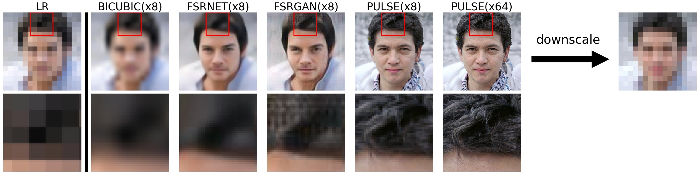
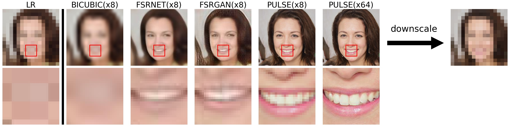

# PULSE: Amostragem de fotos auto-supervisionadas através da Exploração do Espaço Latente de Modelos Generativos
Código que acompanha o papel CVPR'20 com o mesmo título. Ligação em papel: https://arxiv.org/pdf/2003.03808.pdf

## NOTA

Temos notado uma grande preocupação de que o PULSE será utilizado para identificar indivíduos cujos rostos tenham sido esbatidos. Queremos enfatizar que isto é impossível - **PULSE faz caras imaginárias de pessoas que não existem, o que não deve ser confundido com pessoas reais.** Não ajudará*** a identificar ou reconstruir a imagem original.

Queremos também abordar as preocupações de enviesamento em PULSE. **Incluímos agora uma nova secção no [papel](https://arxiv.org/pdf/2003.03808.pdf) e um modelo de cartão de acompanhamento abordando directamente este enviesamento.**

---





Tabela de Conteúdos
=================
- (#pulse-self-supervised-photo-upsampling-via-latent-space-exploration-of-generative-models)
- [Tabela de Conteúdos](#tabela de conteúdos)
  - [O que é que faz?](#o que é que faz)
  - [Utilização](#utilização)
    - [Prereqs](#prereqs)
    - [Dados](#dados)
    - [Aplicar PULSE](#aplicar-pulso)
## O que é que faz? 
Dada uma imagem de entrada de baixa resolução, PULSE procura as saídas de um modelo generativo (aqui, [StyleGAN](https://github.com/NVlabs/stylegan)) para imagens de alta resolução que são perceptualmente realistas e de baixa escala correctamente.


## Utilização

O ficheiro principal de interesse para a candidatura PULSE é `run.py`. Uma lista completa de argumentos com descrições pode ser encontrada nesse ficheiro; aqui descrevemos os que são relevantes para começar.

### Prereqs

Será necessário instalar primeiro o cmake (necessário para o dlib, que é utilizado para o alinhamento facial). Actualmente o código só funciona com CUDA instalado (e por isso requer uma GPU apropriada) e foi testado em Linux e Windows. Para o conjunto completo de pacotes Python necessários, criar um ambiente Conda a partir do YAML fornecido, por exemplo

```
conda create -f pulse.yml 
```
ou (Anaconda no Windows):
```
conda env create -n pulse -f pulse.yml
conda activate pulse
```

Em alguns ambientes (por exemplo, no Windows), poderá ter de editar o pulse.yml para remover o hash específico da versão em cada dependência e remover qualquer dependência que ainda lance um erro depois de executar ```conda env create...``` (tal como readline)
```
dependências
  - blas=1.0=mkl
  ...
```
para
```
dependências
  - blas=1.0
 ...
```

Finalmente, necessitará de uma ligação à Internet na primeira vez que executar o código, pois este descarregará automaticamente o modelo pré-treinado relevante do Google Drive (se já tiver sido descarregado, utilizará a cópia local). No caso do Google Drive público estar fora de capacidade, adicione os ficheiros ao seu próprio Google Drive; obtenha o URL de partilha e substitua o ID nos links https://drive.google.com/uc?=ID em ```align_face.py```` e ``PULSE.py```` com os novos ids de ficheiro do URL de partilha dado pelo seu próprio ficheiro Drive.
 

#### Dados

Por defeito, os dados de entrada para `run.py` devem ser colocados em `./input/` (embora isto possa ser modificado). No entanto, isto pressupõe que os rostos já foram alinhados e reduzidos. Se tiver dados que ainda não estejam nesta forma, coloque-os em `./input/` e execute `align_face.py` que o fará automaticamente por si. (Mais uma vez, todos os directórios podem ser alterados por argumentos de linha de comando, se for mais conveniente). Nesta fase, irá escolher um factor de redução. 

Note que se os seus dados começarem já com uma resolução baixa, a redução de escala irá reter muito pouca informação. Neste caso, poderá desejar aumentar bicubicamente (normalmente, para 1024x1024) e permitir `align_face.py` a redução de escala para si.  

### Aplicar PULSE
Uma vez que os seus dados estejam devidamente formatados, tudo o que precisa de fazer é
```
python run.py
```
Divirta-se!


Traduzido com a versão gratuita do tradutor - www.DeepL.com/Translator
